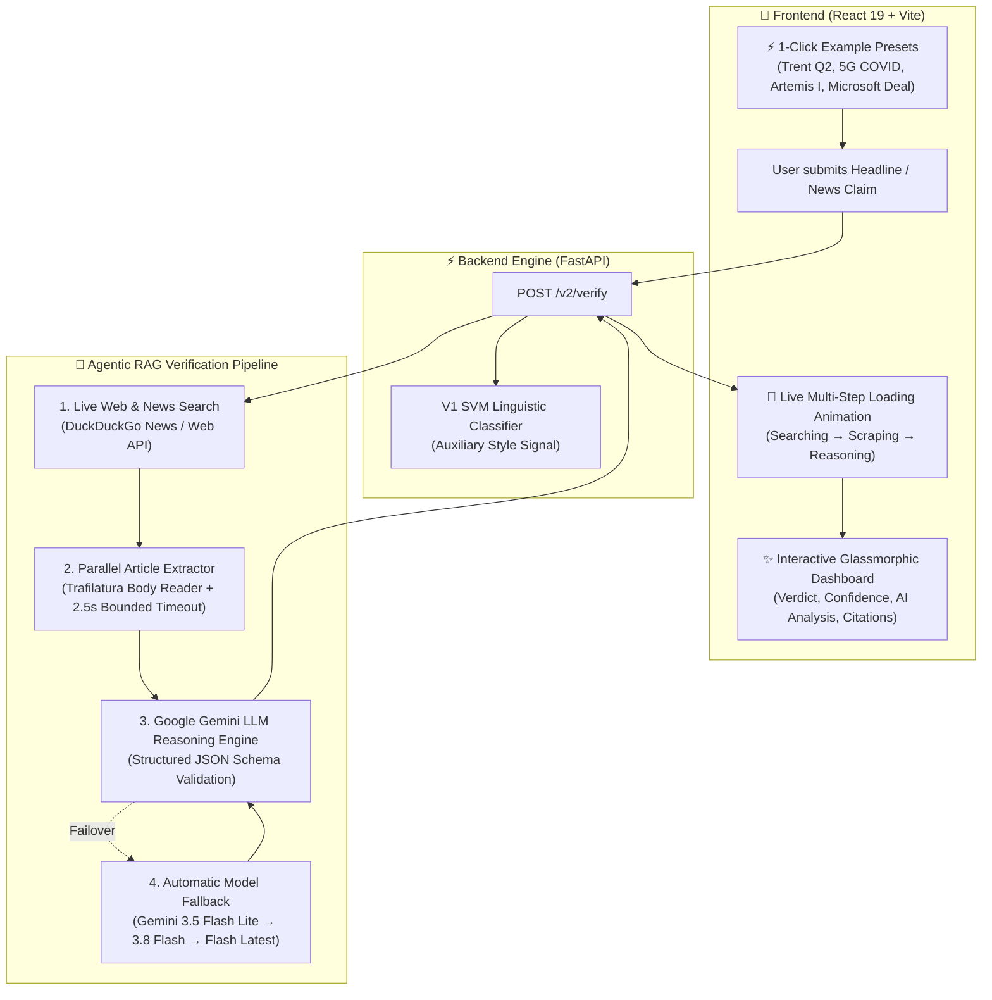

# 🔍 TruthLens AI: Real-Time News & Claim Verification System
### *Next-Gen Retrieval-Augmented Generation (RAG) & LLM Fact-Checking Engine*

[](https://www.python.org/)
[](https://fastapi.tiangolo.com/)
[](https://react.dev/)
[](https://vitejs.dev/)
[](https://aistudio.google.com/)
[](https://opensource.org/licenses/MIT)
[-brightgreen)](#-technology-stack)

---

## 📌 1. Project Overview

**TruthLens AI** is a production-grade, real-time news verification and fact-checking web application powered by **Retrieval-Augmented Generation (RAG)** and **Google Gemini Large Language Models (LLMs)**. 

Traditional machine learning fact-checkers rely on static datasets or small NLI classifiers that evaluate writing style rather than objective real-world facts. **TruthLens AI** solves this by connecting a live web search retrieval pipeline directly to an advanced generative reasoning engine:

1. **Retrieves** real-time breaking news, press releases, and investigative reports across the live internet.
2. **Extracts** full-text journalistic article paragraphs and context.
3. **Reasons** over claims using Google Gemini AI to evaluate factual agreement, numeric precision, temporal context, and source credibility.
4. **Delivers** an authoritative verdict (`SUPPORTED`, `CONTRADICTED`, `MISLEADING`, `UNVERIFIED`) accompanied by structured explanations and direct verbatim citations with clickable source links.

---

## 🚀 2. Key Features

- **⚡ Real-Time Live Search Retrieval:** Indexes live breaking news and web sources via `ddgs` with **zero request limits, zero quotas, and $0 cost**.
- **📄 Deep Full-Article Context Extraction:** Concurrently fetches and parses real article body text using `trafilatura` with strict latency bounds (3–4s average response).
- **🧠 Advanced LLM Reasoning Engine:** Powered by Google Gemini Flash (`gemini-3.5-flash-lite`, `gemini-3.8-flash`, `gemini-flash-lite-latest`) with enforced structured JSON output schemas.
- **📰 Verbatim Source Citations:** Automatically attributes verdicts to established publishers (Reuters, Bloomberg, Associated Press, BBC, The Times of India, official NASA/Gov archives, etc.) with exact quotes.
- **🎨 Glassmorphic Modern UI:** Built with React 19 and Vite featuring glowing verdict badges, dynamic animated multi-step progress bars, 1-click test presets, and 1-click clipboard report exports.
- **🛡️ Hybrid NLP Context:** Includes an auxiliary classical Machine Learning baseline (LinearSVM + TF-IDF trained on 63,000+ WELFake articles) as an informational text-style indicator.

---

## 🏗️ 3. System Architecture & RAG Pipeline



---

## 🔬 4. Why RAG + LLMs Solve Traditional Verification Bottlenecks

| Verification Dimension | Traditional Static ML / Small NLI | 🌟 TruthLens AI (RAG + Gemini Flash) |
| :--- | :--- | :--- |
| **Breaking & Dynamic News** | ❌ Fails (Training cutoff / no live internet access) | ✅ **Real-Time** (Fetches breaking coverage published minutes ago) |
| **Vocabulary & Nuance** | ❌ Brittle (Confused by synonyms, acronyms, slang) | ✅ **Deep Semantic Understanding** (Recognizes that *"Q2"* is *"July–September"*) |
| **Numeric & Financial Claims** | ❌ Fragile (Fails on formatting differences like `23%` vs `23 percent`) | ✅ **Precise Verification** (Verifies actual revenue figures against filing statements) |
| **Transparency & Trust** | ❌ Black-box percentage score | ✅ **Verbatim Citations** with direct external links to publisher articles |
| **Cost & Scalability** | ⚠️ High GPU hosting costs / expensive proprietary APIs | ✅ **100% Free ($0)** using Google AI Studio free tier + free web search |

---

## 📊 5. Verdict Classification Framework

| Verdict | Visual Badge | Meaning & Decision Criteria |
| :--- | :---: | :--- |
| **`SUPPORTED`** | `✅ SUPPORTED` | The core factual assertions, entities, numbers, and events in the claim are corroborated by credible journalistic reporting or primary sources. |
| **`CONTRADICTED`** | `❌ CONTRADICTED` | Credible reporting, official statements, or scientific evidence directly disprove, debunk, or refute the claim. |
| **`MISLEADING`** | `⚠️ MISLEADING` | The claim contains partially accurate information mixed with false, exaggerated, or out-of-context assertions. |
| **`UNVERIFIED`** | `❓ UNVERIFIED` | Insufficient indexed external reporting is currently available. *(Note: UNVERIFIED indicates lack of external reporting, not proven falsity).* |

---

## 🛠️ 6. Technology Stack

### **Backend Core & RAG Engine**
- **Framework:** Python 3.10+, [FastAPI](https://fastapi.tiangolo.com/), Pydantic v2, Uvicorn
- **Generative AI / LLM:** Google Gemini API (`google-genai` / `google-generativeai`)
- **Web Search Retriever:** `ddgs` (DuckDuckGo Search engine integration)
- **Article Context Extractor:** `trafilatura`, `beautifulsoup4`, `lxml_html_clean`
- **Machine Learning (Auxiliary):** Scikit-Learn (LinearSVC, TF-IDF Vectorizer), Joblib
- **Testing:** Pytest (106 unit & integration tests)

### **Frontend User Interface**
- **Library:** [React 19](https://react.dev/), [Vite](https://vitejs.dev/)
- **Styling:** Custom Vanilla CSS (Modern Glassmorphism, Responsive Grid, Glowing Theme)
- **Typography:** Plus Jakarta Sans & Inter (Google Fonts)
- **Networking:** Axios with automated timeout handling

---

## 📁 7. Repository Structure

```text
Real-Time-News-Verification-System/
├── backend/
│   ├── app/
│   │   ├── main.py                     # FastAPI application entry point & CORS
│   │   ├── predictor.py                # V1 LinearSVC ML style classifier
│   │   ├── schemas.py                  # V1 request & response models
│   │   └── v2/
│   │       ├── rag_verifier.py         # 🧠 Core RAG AI Engine (DDGS + Trafilatura + Gemini)
│   │       ├── router.py               # REST API endpoints (/v2/verify)
│   │       ├── schemas.py              # Pydantic models (EvidenceItem, Verdicts, Citations)
│   │       ├── verification_service.py # Orchestrator & legacy pipeline coordinator
│   │       ├── query_builder.py        # Proposition-driven search query generator
│   │       └── test_*.py               # Comprehensive backend pytest test suite (106 tests)
│   ├── models/                         # Pre-trained TF-IDF & LinearSVM model weights
│   └── requirements.txt                # Python dependencies
├── frontend/
│   ├── src/
│   │   ├── components/
│   │   │   ├── NewsForm.jsx            # Claim input form, presets & animated loader
│   │   │   ├── V2VerificationResult.jsx# Glassmorphic verdict cards & citation viewer
│   │   │   └── PredictionResult.jsx    # V1 linguistic style analysis card
│   │   ├── App.jsx                     # Main React application shell & tab navigation
│   │   ├── api.js                      # Axios HTTP client configuration
│   │   └── index.css                   # Premium CSS design system & micro-animations
│   ├── package.json                    # Frontend dependencies & scripts
│   └── vite.config.js                  # Vite bundler configuration
└── README.md                           # Project documentation
```

---

## ⚡ 8. Getting Started (Local Setup)

### **Prerequisites**
- Python `3.10+`
- Node.js `18+` and npm
- A free **Google Gemini API Key** from [Google AI Studio](https://aistudio.google.com/app/apikey) ($0 cost, no credit card required).

---

### **1. Clone the Repository**
```bash
git clone https://github.com/PrakharKashyap21/Real-Time-News-Verification-System.git
cd Real-Time-News-Verification-System
```

---

### **2. Backend Setup**

1. Install Python dependencies:
```bash
pip install -r backend/requirements.txt
```

2. Configure your environment variables in `backend/.env`:
```env
GEMINI_API_KEY=your_gemini_api_key_here
```

3. Launch the FastAPI server:
```bash
python3 -m uvicorn backend.app.main:app --host 127.0.0.1 --port 8008 --reload
```
* Backend API: `http://127.0.0.1:8008`
* Interactive API Documentation (Swagger UI): `http://127.0.0.1:8008/docs`

---

### **3. Frontend Setup**

1. In a new terminal tab, navigate to `frontend` and install packages:
```bash
cd frontend
npm install
```

2. Start the Vite development server:
```bash
npm run dev
```
* Open [**http://localhost:5173**](http://localhost:5173) in your browser.

---

### **4. Running Automated Tests**

```bash
# Run backend pytest suite (106 unit & integration tests)
PYTHONPATH=. pytest backend/app/v2/ -q

# Run frontend linting and production build verification
cd frontend
npm run lint
npm run build
```

---

## 📡 9. API Reference

### **Verify News Claim (`POST /v2/verify`)**

#### Request Payload
```json
{
  "title": "Trent Q2 standalone revenue",
  "text": "Indian retailer Trent reported a 23% year-on-year rise in standalone revenue in the July-September 2026 quarter.",
  "include_linguistic_signal": true
}
```

#### Sample Response
```json
{
  "overall_assessment": "SUPPORTED",
  "assessment_summary": "The claim is fully substantiated by credible financial news sources reporting on Trent's performance for the July-September quarter (Q2 FY27). Multiple outlets confirm a 23% year-on-year increase in standalone revenue reaching ₹5,788 crore.",
  "has_conflict": false,
  "claims": [
    {
      "claim_id": "claim_1",
      "text": "Indian retailer Trent reported a 23% year-on-year rise in standalone revenue in the July-September 2026 quarter.",
      "verdict": "SUPPORTED",
      "reasoning": "Multiple credible news sources confirm that Indian apparel retailer Trent reported a 23% year-on-year increase in standalone revenue for the July-September quarter.",
      "evidence": [
        {
          "publisher": "Reuters",
          "domain": "reuters.com",
          "url": "https://www.reuters.com/world/india/indias-fast-fashion-retailer-trent-reports-higher-quarterly-revenue-2026-10-05/",
          "title": "India's fast-fashion retailer Trent reports higher quarterly revenue",
          "snippet": "Indian apparel retailer Trent reported a 23% year-on-year rise in standalone revenue for the second quarter on Monday...",
          "stance": "SUPPORTS"
        }
      ]
    }
  ],
  "service_status": {
    "search_engine": "ok",
    "gemini_api": "ok",
    "rag_pipeline": "active"
  }
}
```

---

## 📄 10. License

This project is licensed under the [MIT License](LICENSE).
