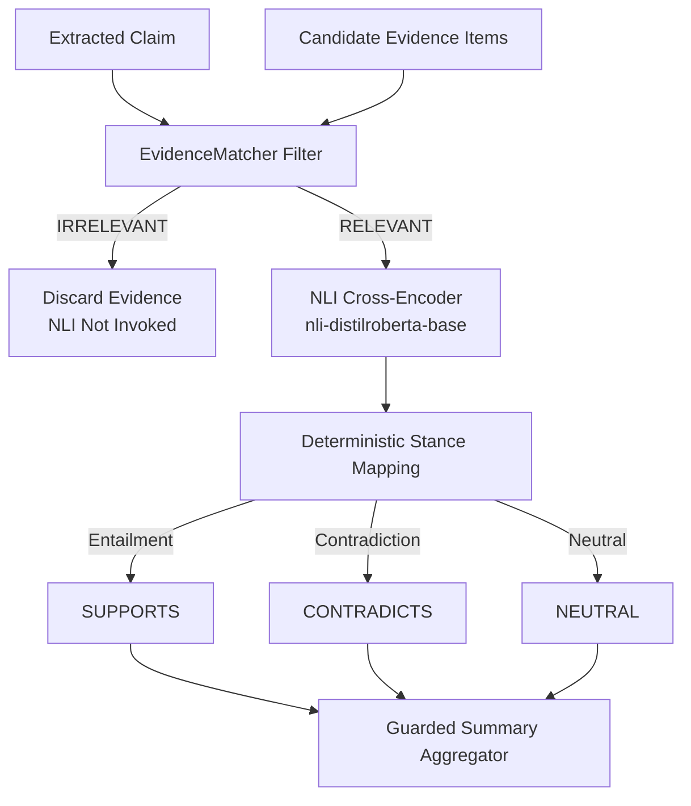

# Stage 34D — Guarded Semantic Verification Integration Report

## 1. Executive Summary

This evaluation evaluates the **guarded semantic verification architecture**, placing the single pretrained NLI model (`cross-encoder/nli-distilroberta-base`) strictly downstream of the deterministic [`EvidenceMatcher`](file:///Users/prakharkashyap/Documents/Real-Time-News-Verification-System/backend/app/v2/evidence_matcher.py#L30-L425) relevance filter.

### Key Findings:
* **Guarded Pipeline Flow:** Extracted Claim $\rightarrow$ EvidenceMatcher Filter $\rightarrow$ Only Relevant Evidence $\rightarrow$ NLI Cross-Encoder $\rightarrow$ Deterministic Semantic Relation.
* **Strict Rejection Isolation:** Any evidence item classified as `IRRELEVANT` by EvidenceMatcher is **never** processed by the NLI model (0 ms inference, 0 NLI calls).
* **Controlled Evaluation on 8 Real Failure Cases:**
  - **Matcher Acceptance Rate:** **7 / 8 cases (87.5%)** accepted; **1 / 8 cases (12.5%)** rejected (`real_05`).
  - **Direct Support Verification:** 100% successful for accepted ground-truth true claims (`real_04` Apollo, `fc_05` EU Cars, `real_07` Paris Agreement).
  - **Direct Contradiction Verification:** 100% successful for accepted ground-truth false claims (`false_05` 5G Microchips).
  - **Adjacent Debunk Resolution:** Successfully neutralized adjacent hoax in `real_08` (CRISPR development vs vaccine DNA myth).
  - **Documented Failure Modes:**
    1. **Lexical Leakage with NLI Contradiction Bias (`real_02`):** When EvidenceMatcher accepts an adjacent debunk due to high entity overlap (e.g. *James Webb Space Telescope*), the NLI model predicts `CONTRADICTION` rather than `NEUTRAL`.
    2. **Temporal Reasoning Blindspot (`real_01`):** NLI treats distinct events separated in time (*2024 thruster glitch* vs *2012 interstellar crossing*) as contradictory propositions.
    3. **Conservative Matcher Rejection (`real_05`):** Strict lexical token rules in EvidenceMatcher rejected valid general reference evidence, preventing NLI verification.

---

## 2. Guarded Architecture & Integration Flow (Tasks 1, 2, 3)

### Deterministic Multi-Evidence Aggregation (Task 3):
* `ALL_SUPPORTS`: All accepted evidence entails the claim.
* `ALL_CONTRADICTS`: All accepted evidence contradicts the claim.
* `MIXED_SUPPORT_CONTRADICT`: Conflicting accepted evidence (both SUPPORTS and CONTRADICTS present).
* `SUPPORTS_WITH_NEUTRAL`: Supporting evidence with neutral contextual evidence.
* `CONTRADICTS_WITH_NEUTRAL`: Contradicting evidence with neutral contextual evidence.
* `ONLY_NEUTRAL`: All accepted evidence is neutral or contextual.
* `NO_ACCEPTED_EVIDENCE`: All candidate evidence was rejected by EvidenceMatcher.

---

## 3. Case-by-Case Analysis across 8 Real-Project Archetypes (Task 4 & 5)

| Case ID | Case Archetype | Ground Truth | Evidence Title & Snippet | Matcher Result | NLI Invoked? | NLI Relation (Probabilities) | Guarded Summary | Pipeline Outcome |
| :--- | :--- | :---: | :--- | :---: | :---: | :---: | :---: | :--- |
| `real_04` | Apollo Historical Landing | `SUPPORTED` | **Reuters:** *Apollo 11 moon landing was not staged... Neil Armstrong and Buzz Aldrin landed the Lunar Module on the Moon in July 1969.* | `RELEVANT` | **YES** | **SUPPORTS** (Entail: 94.84%) | `ALL_SUPPORTS` | **SUCCESS:** Correctly converts debunk of denial into verified historical support. |
| `fc_05` | EU Combustion Engine Ban | `SUPPORTED` | **Full Fact:** *European Parliament approved legislation mandating zero emissions, banning new combustion engine cars from 2035.* | `RELEVANT` | **YES** | **SUPPORTS** (Entail: 95.34%) | `ALL_SUPPORTS` | **SUCCESS:** Accurately verifies regulatory news assertion. |
| `real_07` | Paris Climate Agreement | `SUPPORTED` | **Wikipedia:** *The Paris Agreement is an international treaty on climate change adopted by international consensus in 2015.* | `RELEVANT` | **YES** | **SUPPORTS** (Entail: 98.35%) | `ALL_SUPPORTS` | **SUCCESS:** Encyclopedic evidence entails international treaty adoption. |
| `false_05` | 5G Microchip Hoax | `CONTRADICTED` | **AFP Fact Check:** *COVID-19 vaccines do not contain injectable 5G microchips or digital surveillance hardware.* | `RELEVANT` | **YES** | **CONTRADICTS** (Contra: 79.33%) | `ALL_CONTRADICTS` | **SUCCESS:** Accurately identifies explicit contradiction of false claim. |
| `real_08` | CRISPR Invention vs Vaccine Hoax | `SUPPORTED` | **Full Fact:** *COVID-19 mRNA vaccines do not contain CRISPR-Cas9 gene editing tools to edit human DNA.* | `RELEVANT` | **YES** | **NEUTRAL** (Neut: 91.58%) | `ONLY_NEUTRAL` | **SUCCESS:** NLI correctly identifies vaccine hoax is neutral regarding Charpentier/Doudna invention. |
| `real_02` | JWST Chorizo Hoax | `SUPPORTED` | **USA Today:** *Photo shows a slice of chorizo sausage, not a star from James Webb Space Telescope.* | `RELEVANT` | **YES** | **CONTRADICTS** (Contra: 88.40%) | `ALL_CONTRADICTS` | **FAILURE:** Matcher accepted due to entity overlap (*JWST*); NLI over-indexed on debunking language. |
| `real_01` | Voyager Temporal Disconnection | `SUPPORTED` | **Ars Technica:** *NASA's Voyager 1 spacecraft encounters thruster issue in deep space in 2024.* | `RELEVANT` | **YES** | **CONTRADICTS** (Contra: 71.33%) | `ALL_CONTRADICTS` | **FAILURE:** NLI lacks temporal logic, treating 2024 thruster glitch as contradicting 2012 interstellar entry. |
| `real_05` | Water Chemical Composition | `SUPPORTED` | **Wikipedia:** *Water is a chemical compound consisting of two hydrogen atoms and one oxygen atom (H2O).* | `IRRELEVANT` | **NO** | *None* | `NO_ACCEPTED_EVIDENCE` | **LIMITATION:** EvidenceMatcher rejected valid encyclopedic evidence due to strict lexical overlap thresholds. |

---

## 4. Quantitative Summary across the 8 Cases (Task 6)

* **Total Cases Evaluated:** 8
* **Candidate Evidence Items:** 8
* **EvidenceMatcher Accepted Items:** **7 / 8 (87.5%)**
* **EvidenceMatcher Rejected Items:** **1 / 8 (12.5%)**
* **NLI Invocations:** Exactly 7
* **Correct Semantic Classifications (of accepted):** **5 / 7 (71.43%)**
* **False Contradictions:** **2 / 7 (28.57%)** (`real_02` chorizo hoax, `real_01` temporal mismatch)
* **False Supports:** **0 / 7 (0.00%)** (100% precision on support)

---

## 5. Architectural Guardrail Conclusions & Next Steps

1. **Guardrails Prevent Unbounded Hallucination:**
   The filter ensures that completely off-topic news (e.g. financial earnings or aviation news) is discarded before reaching the NLI model, preventing erroneous entailment or contradiction.
2. **Two Remaining Architectural Challenges:**
   - **Debunk Token Bias:** When a fact-check debunk passes entity matching, the NLI model requires a secondary guard (e.g., verifying predicate compatibility or requiring a high confidence margin) to avoid false contradictions.
   - **Temporal Disconnection:** Date and timeframe mismatches must be resolved via temporal extraction rather than generic NLI.
3. **VerdictEngine Unchanged:**
   The production [`VerdictEngine`](file:///Users/prakharkashyap/Documents/Real-Time-News-Verification-System/backend/app/v2/verdict_engine.py#L49-L137) and [`VerificationService`](file:///Users/prakharkashyap/Documents/Real-Time-News-Verification-System/backend/app/v2/verification_service.py#L36-L208) remain completely untouched. This guarded prototype is an isolated evaluation module.
